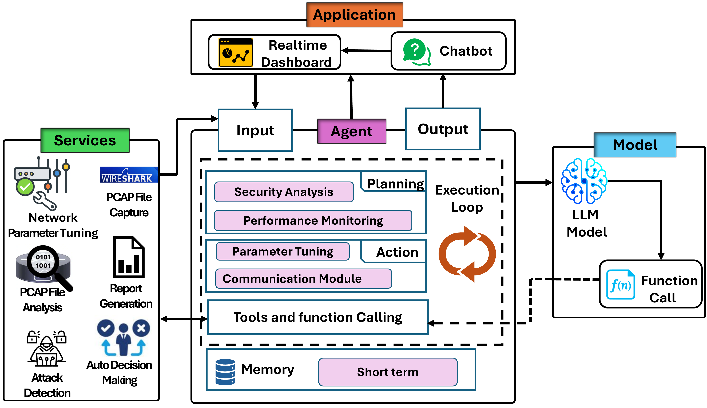
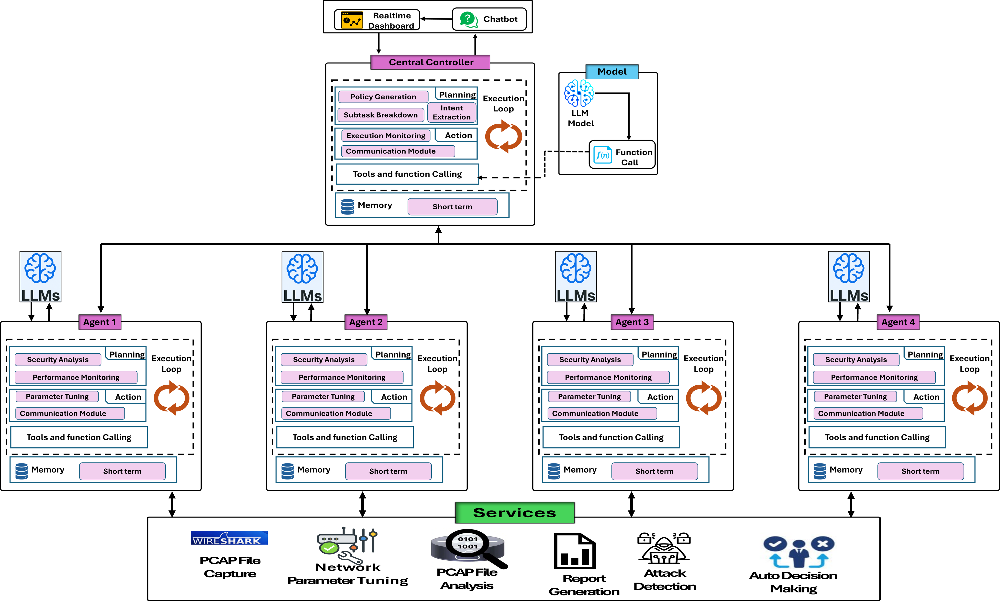

# NetMoniAI: An Agentic AI Framework for Network Security & Monitoring

[](LICENSE)
[](https://www.python.org/downloads/)
[](https://arxiv.org/abs/2508.10052)

**NetMoniAI** is an agentic AI framework for automatic network monitoring and security that integrates decentralized analysis with lightweight centralized coordination. The framework consists of autonomous micro-agents at each node for local traffic analysis, and a central controller that aggregates insights to detect coordinated attacks.

📄 **Paper**: [NetMoniAI: An Agentic AI Framework for Network Security & Monitoring](https://arxiv.org/abs/2508.10052)  
🔗 **GitHub**: https://github.com/pzambare3/NetMoniAI

---

## ✨ Features

- **Hybrid Monitoring**: Combines packet-level and flow-level analysis for scalable threat detection
- **Autonomous Node Agents**: Each node runs integrated agent pipeline with LLM-powered semantic analysis
- **Two-Tier Architecture**: Decentralized node intelligence + centralized threat correlation
- **LLM Integration**: Supports GPT-O3, Gemini Pro, and local BERT for adaptive threat detection
- **Real-Time Dashboard**: WebSocket-based visualization with attacker/victim role identification
- **Validated Performance**: Tested on local testbed and NS-3 simulations (up to 50 nodes)

---

## 🏗️ Architecture

### Node-Level Agents



Each node runs an integrated agent pipeline with specialized modules:
- **PerformanceMonitoringAgent** - Metrics collection and threshold monitoring
- **SecurityAnalysisAgent** - LLM-based threat detection
- **ReportingAgent** - Structured report generation
- **ParameterTuningAgent** - Adaptive threshold adjustment
- **ChatAgent** - Natural language interface

### Central Controller (Global Controller)



Aggregates node reports to detect coordinated attacks:
- Correlates events across nodes via short-term memory
- Classifies nodes as attackers, victims, or benign
- Maintains system-wide situational awareness

> **Note**: Code uses "Global Controller" (gc prefix) which refers to the Central Controller in the paper.

## 📁 Repository Structure (high level)

```
backend/
  app.py                 # FastAPI app (REST)
  appWebsocket.py        # WebSocket server (if run separately)
  config.py              # Backend config (envs, ports, etc.)
  utils.py, common_classes.py
  nw_agents/             # Agent implementations
  tools/                 # PCAP + attack detection utilities
  *.xml                  # Simulation/animation scenarios
  *.log                  # Logs (runtime & metrics)
  requirements.txt

frontend/
  public/                # Static assets + default nodes/packets JSON
  src/                   # React app (components, API service, styles)
  package.json
  README.md              # Frontend-specific notes (if any)

requirements.txt         # (root if used)
Architecture.jpeg
.gitignore
```

---

## 🚀 Quick Start (Developer Setup)

### Prerequisites
- **Python** 3.10+
- **Node.js** 18+ and **npm** 9+
- **Git**

> If you later see CORS or connection issues, it’s usually a URL/port mismatch between the frontend and backend.

### 1) Backend (FastAPI)

```bash
# from repo root
cd backend

# create & activate a virtualenv
# Windows (PowerShell)
python -m venv .venv
. .venv/Scripts/Activate.ps1

# macOS/Linux
# python3 -m venv .venv
# source .venv/bin/activate

# install deps
pip install -r requirements.txt
```

Create a `.env` (optional, recommended). Open `backend/config.py` to see recognized variables (ports, log level, API keys). Example:

```bash
# backend/.env (example)
APP_HOST=0.0.0.0
APP_PORT=8000
LOG_LEVEL=INFO
# If you use any LLM/API keys, define them here too
# OPENAI_API_KEY=...
```

Run the REST API (option A):

```bash
# from repo root so module imports resolve
uvicorn backend.app:app --reload --host 0.0.0.0 --port 8000
```

Run a separate WebSocket server (option B, only if your design splits them):

```bash
# check appWebsocket.py for the actual port/path used
python backend/appWebsocket.py
```

> If your WebSocket is integrated into the same FastAPI app, you only need the first command.

---

### 2) Frontend (React)

```bash
# in a new terminal, from repo root
cd frontend
npm install
```

Configure environment for API/WS URLs (either via `.env` or update `src/apiService.js`):

```bash
# frontend/.env (example)
REACT_APP_API_URL=http://localhost:8000
REACT_APP_WS_URL=ws://localhost:8001
```

Start the dev server:

```bash
npm start
```

Open **http://localhost:3000** in your browser.

---
## 📖 Usage

### Real-Time Monitoring (Local Testbed)

The system automatically monitors network performance. When anomalies are detected (high latency, packet loss), agents:

1. Capture network traffic using tshark
2. Analyze packets with LLM inference
3. Generate structured reports
4. Send alerts to the dashboard via WebSocket

### Offline Analysis (NS-3 Simulations)

Process PCAP files from NS-3 simulations:

```bash
cd backend
python analyze_nodes.py
```

This script:
- Reads PCAP files from `segregated/segregated_pcaps*`
- Analyzes each node's traffic with SecurityAnalysisAgent
- Posts reports to the central controller (`POST /gcreport`)
- Updates the dashboard with attacker/victim classifications

The `analyze_nodes.py` script handles:
- Rate limiting for Gemini API (5 RPM, 25 RPD)
- Automatic retry with exponential backoff
- Time-series metrics extraction
- JSON serialization for the controller

### Demo Mode (No Backend Required)

The frontend can run independently using demo JSON files:
- `frontend/public/nodes_data.json` - 8-node scenario
- `frontend/jsons/jsons-20-nodes/` - 20-node scenario

Just start the frontend without the backend to explore the UI.

---


## 🔌 API & WebSocket (adjust to your code)

Exact routes depend on your `backend/app.py` and `appWebsocket.py`. Common patterns include:

- Health: `GET /health`
- Analyze/ingest: `POST /analyze` (e.g., analyze PCAP/JSON data)
- WebSocket: `ws://<host>:<port>/ws` (stream metrics/events)

Check the files to confirm the actual endpoints/paths and update the frontend `apiService.js` accordingly.

---


## 🔧 Tools & Utilities

### PCAP Analysis (`backend/tools/`)

- `pcap_analyzer.py` - Parse and extract features from PCAP files
- `attack_detection.py` - Heuristic-based attack detection
- `data_collection.py` - Metrics aggregation

**Example**:
```bash
python backend/tools/pcap_analyzer.py path/to/capture.pcap
```

### Simulation Files

NS-3 scenario XMLs are included in `backend/`:
- `dos-simulation-animation.xml` - DoS attack scenario
- `syn-flood-animation.xml` - SYN flood scenario
- `simulation3.xml` - Multi-attack scenario

---


## 🧪 Evaluation Results

NetMoniAI was evaluated in two environments:

### Local Micro-Testbed
- **Setup**: Ubuntu 22.04 with network degradation (600ms delay, 1Mbps bandwidth)
- **Result**: Detected anomalies within 5 seconds, with accurate threat classification
- **Tools**: Linux `tc` utility, macOS Network Link Conditioner

### NS-3 Simulation
- **Setup**: 8-node virtual network with coordinated TCP flood attack
- **Result**: Successfully identified attackers (Node 1) and victims (Nodes 4, 6)
- **Detection**: Real-time correlation across distributed nodes

The system demonstrated:
- ✅ Low-latency detection (< 5 seconds)
- ✅ Accurate role classification (attacker/victim/benign)
- ✅ Scalable distributed architecture
- ✅ Interpretable LLM-generated reports

---

## 🗂 Logs & History

- `backend/agent_app.log`, `backend/network_metrics.log`, `backend/metrics_metrics.log`
- History snapshots: `backend/history.json`, `backend/history_backup.json`

These help with debugging and reviewing prior events.

---

## 🛠 Troubleshooting

- **CORS errors**: ensure `REACT_APP_API_URL` matches your backend host/port; enable CORS in FastAPI if needed.
- **WebSocket not connecting**: verify the WS port and path; align `REACT_APP_WS_URL` with `appWebsocket.py` (or the WS route in `app.py`).
- **Module import issues**: run servers from the **repo root** so `backend/` resolves as a package.
- **Windows PowerShell venv activation**: use `. .venv/Scripts/Activate.ps1`. If blocked, run `Set-ExecutionPolicy -Scope CurrentUser RemoteSigned` (then reopen PowerShell).

---
## 🔧 Configuration & Customization

### Changing LLM Models

The framework supports multiple LLM backends, but changing models requires **code modifications**:

**Supported Models**:
- **Gemini Pro** (Google) - Default in evaluation
- **GPT-O3** (OpenAI) - Used in paper experiments
- **Local BERT** (Hugging Face) - For offline/resource-constrained environments

**To switch models**, edit `backend/nw_agents/SecurityAnalysisAgent.py`:

```python
# Example: Change from Gemini to GPT
# Locate the model initialization section and update:

# FROM (Gemini):
import google.generativeai as genai
genai.configure(api_key=os.getenv("GEMINI_API_KEY"))
model = genai.GenerativeModel('gemini-pro')

# TO (GPT):
---
## 📦 Production Build

```bash
# frontend
npm run build
# serve the build with your preferred static server or reverse proxy (nginx, etc.)
```

Run backend with a production server (e.g., `uvicorn` behind `gunicorn`/`nginx`) and set proper environment variables.

---

## 📚 Citation

If you use NetMoniAI in your research, please cite:

```bibtex
@article{zambare2025netmoniai,
  title={NetMoniAI: An Agentic AI Framework for Network Security \& Monitoring},
  author={Zambare, Pallavi and Thanikella, Venkata Nikhil and 
          Kottur, Nikhil Padmanabh and Akula, Sree Akhil and Liu, Ying},
  journal={arXiv preprint arXiv:2508.10052},
  year={2025}
}
```

---

## 📄 License

This project is dual-licensed under:
- **MIT License** - see LICENSE-MIT
- **Apache License 2.0** - see LICENSE-APACHE

**SPDX-License-Identifier**: MIT OR Apache-2.0

---

## 🤝 Contributing

We welcome contributions! Please:
1. Fork the repository
2. Create a feature branch: `git checkout -b feature/amazing-feature`
3. Commit your changes: `git commit -m 'Add amazing feature'`
4. Push to the branch: `git push origin feature/amazing-feature`
5. Open a Pull Request

For detailed guidelines, see [CONTRIBUTING.md](CONTRIBUTING.md) (if you want this file, let me know!).

---

## 👥 Authors

- **Pallavi Zambare** - Texas Tech University - pzambare@ttu.edu
- **Venkata Nikhil Thanikella** - nikhilvenkata.t@gmail.com
- **Nikhil Padmanabh Kottur** - nkotturi@ttu.edu
- **Sree Akhil Akula** - sreakula@ttu.edu
- **Ying Liu** - y.liu@ttu.edu (Project Lead)

---
